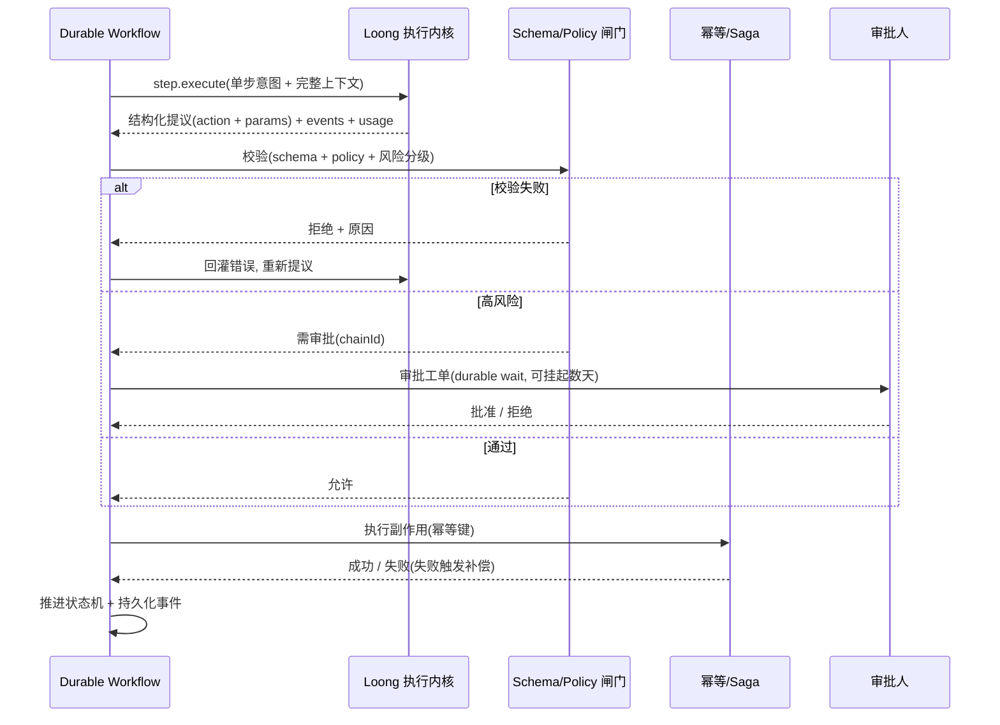

# 确定性编排落地设计（Deterministic Orchestration）

> 版本：v0.1（落地设计草案）
> 关联：[LOONG_PRODUCT_ARCHITECTURE.md](./LOONG_PRODUCT_ARCHITECTURE.md) · [ARCHITECTURE.md](./ARCHITECTURE.md) · ClawWorks-Server《企业级 Agent 数字员工目标架构方案》
> 目标读者：Loong 内核 / Gateway 维护者、ClawWorks-Server 编排面实现者

---

## 0. 一句话结论

确定性编排 =
**Loong 退回「无状态单步执行器」**（剥离 `SessionTurnCoordinator` 进程内状态、`query-loop` 降级为编排步骤策略）
**+ 上层引入 Durable Workflow 引擎**（FSM+MySQL 过渡 → Temporal）
**+ 四道确定性闸门**（Schema 校验 / Policy-as-Code / 幂等 / Saga，其中 Schema 与 Policy/审批复用 `@loong/suite` 与 `@loong/org`）
**+ 人工 HITL durable wait**（复用 `@loong/org` 审批链）。

Loong 的推理内核（tool-loop、技能、记忆、`core/tiers.ts` 分级、`@loong/providers` fallback）**一行不重写**，只是被「降级」为工作流中被调用的一个 activity。

---

## 1. 目标与非目标

### 1.1 目标

| 维度 | 目标 |
|------|------|
| 确定性 | 业务流转由状态机驱动；分支由代码决定，不由模型自由发挥 |
| 可重放 | 工作流状态持久化 + 事件溯源，进程崩溃后从断点重放，结果一致 |
| exactly-once | 副作用动作带幂等键去重；失败按 Saga 反向补偿 |
| 可审计 | 决策链（输入→提议→校验→审批→副作用→结果）结构化留痕 |
| 渐进 | Loong 内核能力复用，新增能力以外置编排面叠加 |

### 1.2 非目标

- 不重写 Loong 的推理 / 工具 / 记忆 / 模型路由内核。
- 不追求「全流程全确定性」——探索类任务保留受控自主区（见 §9）。
- 本阶段不引入桌面端 / IDE 形态相关改造。

---

## 2. 现状问题（基于真实代码）

| 问题 | 证据 | 影响 |
|------|------|------|
| 「下一步做什么」由模型 tool-loop 概率推断 | `packages/core/src/query-loop.ts` 的 `shouldContinueQueryLoop()` 只是「要不要再转一圈」的启发式 | 流转不确定、不可重复 |
| 会话/队列状态在进程内 | `packages/gateway/src/session-coordinator.ts` 的 `SessionTurnCoordinator`（`#queues` / `#waiters` / `#activeSessions` + 内存 `Deferred`） | 重启即丢、不可水平扩展、不可重放 |
| 副作用无幂等/无补偿 | `query-loop` 续跑/重试无幂等键 | 重试可能重复产生副作用 |
| 策略/审批是「建议」而非「强制点」 | `@loong/org` 已有 `ToolPolicyRule` / `OrgRiskLevel` / `OrgApprovalChain`，但未接入工具执行前的强制裁决路径 | 业务正确性无硬保证 |

**结论**：Loong 当前「既当执行器、又当编排者」。本设计要做的是把「编排者」身份剥离出去，交给确定性引擎。

---

## 3. 总体架构

```mermaid
flowchart TB
    BIZ[业务系统 / 渠道] --> WF

    subgraph ORCH["编排面 Orchestration Plane（确定性 · ClawWorks-Server）"]
      WF["Durable Workflow 引擎<br/>FSM + 事件溯源 + durable timer"]
      GATE["确定性闸门<br/>Schema 校验 + Policy-as-Code"]
      SAGA["幂等 / Saga 补偿"]
      HUMAN["人工审批 HITL<br/>durable wait"]
    end

    subgraph EXEC["执行面 Execution Plane（Loong 无状态内核）"]
      STEP["step.execute<br/>单步：意图理解 + 槽位填充"]
      TOOL["工具执行（沙箱 / MCP）"]
      MODEL["模型路由 + fallback + tier"]
    end

    subgraph DATA["数据面 Data Plane"]
      WFDB[("工作流状态库 / 事件库")]
      IDEM[("幂等键表")]
      OBJ[("会话 / 记忆 / 产物对象存储")]
      AUDIT[("审计 WORM")]
    end

    BIZ --> WF
    WF -->|单步请求(完整上下文)| STEP
    STEP -->|结构化提议| GATE
    GATE -->|不合法| WF
    GATE -->|高危| HUMAN
    GATE -->|通过| SAGA
    HUMAN --> WF
    SAGA --> WF
    EXEC --> MODEL
    WF --> WFDB
    SAGA --> IDEM
    EXEC --> OBJ
    ORCH --> AUDIT
```

**职责切分**：

- **编排面（ClawWorks-Server）**：拥有流程状态、决定流转、调用闸门、管理审批与补偿。系统真相源。
- **执行面（Loong）**：无状态，只接收「单步任务（含完整上下文）」→ 返回「结构化提议 + 事件 + 用量」。
- **数据面**：工作流状态 / 事件 / 幂等键 / 对象存储 / 审计，全部外置。

---

## 4. 核心范式：模型提议，确定性引擎裁决

> **流程怎么走** = 工作流状态机决定（确定）
> **这一步填什么** = 模型决定（非确定，关进「单步」笼子）
> **能否产生副作用** = 确定性闸门裁决（Schema + Policy + 幂等 + Saga）

模型的非确定性被约束在「单步提议」内，任何业务副作用必须穿过四道闸门才能生效。



---

## 5. 执行面改造：Loong 无状态单步执行器

### 5.1 改造清单

| 项 | 现状 | 改造后 |
|----|------|--------|
| 并发/顺序 | `SessionTurnCoordinator` 进程内 `#queues`/`#activeSessions` | 删除；并发与顺序由编排面控制（单 workflow 实例天然串行） |
| 续跑 | `shouldContinueQueryLoop()` 由 Loong 自决 | 降级为「编排面的一个步骤策略」；Loong 单次只跑一步 |
| 会话/记忆 | 写本地 `.loong` | 走外置存储适配器（对象存储 + 元数据库） |
| 限流 | `gateway/rate-limit.ts` 进程内 + 按 IP | 移出进程；按租户/员工（见 product 架构 §9） |
| 状态 | 进程内 `Deferred`/`Map` | 无隐藏状态，纯函数式单步 |

### 5.2 单步执行接口

```typescript
// 执行面对外契约（无隐藏状态：输入完整、输出结构化）
interface StepRequest {
  tenantId: string;
  employeeId: string;
  suiteRef: { id: string; version: string };
  stepContext: StepContext;        // 编排面传入的完整上下文（不在 Loong 内攒）
  allowedTools: string[];          // 本步允许的工具白名单
  modelPolicy: {
    tier?: "fast" | "standard" | "deep";   // 复用 core/tiers.ts
    fallbacks?: string[];                   // 复用 @loong/providers fallback
  };
  budget: { maxTokens?: number; maxCostUsd?: number };
  idempotencyKey: string;          // 同 key 重放 → 同结果，不重复副作用
  mode: "propose" | "tool";        // propose=仅出结构化提议；tool=执行无副作用只读工具
}

interface StepContext {
  intent: string;
  history?: ReadonlyArray<{ role: string; content: string }>;  // 由编排面注入
  memoryRefs?: string[];           // 外置记忆句柄
  schemaRef?: string;              // 期望产出 schema（来自 suite schemas/*）
  metadata?: Record<string, unknown>;  // delegationTaskType / taskRisk / requiredRole 等（喂给 causal-learning）
}

interface StepResult {
  status: "ok" | "error";
  proposal?: { action: string; params: unknown };   // 结构化、可被 schema 校验
  toolResult?: unknown;            // mode=tool 时
  events: LoongEvent[];            // lifecycle / assistant_delta / tool（复用现有事件模型）
  usage: { tokens: number; costUsd: number; latencyMs: number };
}
```

**不变量**：相同 `idempotencyKey + StepRequest` 重放，必须得到一致的 `StepResult`（副作用只发生一次，由编排面的幂等表兜底，见 §7.3）。

### 5.3 渐进策略：先包一层适配器

为降低风险，**不直接拆 `core`**。第一步在 Gateway 暴露一个无状态适配器 `step.execute`，内部仍调用现有 runtime，但：

1. 绕过 `SessionTurnCoordinator`（不走 `runOrEnqueue`）。
2. `maxTurns = 1`（`resolveQueryLoopMaxTurns(false, ...)`），强制单步。
3. 会话历史改由 `StepContext.history` 注入，不读写本地 session 目录。

跑通后再逐步把 `core` 内部的状态依赖剥干净。

---

## 6. 编排面设计：Durable Workflow

### 6.1 形态选型（C → B 渐进）

| 阶段 | 方案 | 理由 |
|------|------|------|
| 过渡（先能上线） | 自研轻量 **FSM + MySQL 状态表 + 事件溯源** | 成本低、可控、复用 ClawWorks-Server MySQL |
| 成熟（能力拉满） | 迁移到 **Temporal** | durable execution / replay / timer / signal 工业级 |

预留接口：把「工作流定义」抽象成 `WorkflowDefinition`，FSM 引擎与 Temporal 都实现同一接口，业务流程定义不随引擎变化。

### 6.2 四个硬能力

| 能力 | 作用 |
|------|------|
| 持久化状态机 | 分支由状态/代码决定 |
| 事件溯源 + replay | append-only 历史，崩溃后断点重放，编排逻辑纯函数化 |
| Durable timer / signal | 审批/等待挂起数天不占资源 |
| 幂等 + Saga | 副作用去重 + 失败反向补偿 |

### 6.3 工作流定义示例

```typescript
async function refundWorkflow(ctx: WorkflowCtx, order: Order) {
  // 1. 模型仅出结构化提议（单步、无副作用）
  const proposal = await ctx.activity(loongStep, {
    stepContext: { intent: "refund", schemaRef: "refund.v1", metadata: { taskRisk: "high" } },
    mode: "propose",
    idempotencyKey: `${order.id}:propose`,
  });

  // 2. 确定性闸门（纯函数，可重放）
  const verdict = ctx.gate(proposal, { schema: "refund.v1", policy: order.tenantId });
  if (verdict.invalid) return ctx.retryStep(verdict.reason);   // 回灌错误重提
  if (verdict.risk === "high") {
    await ctx.waitForApproval(verdict.chainId);                 // durable wait
  }

  // 3. 副作用：幂等键 + Saga 补偿
  await ctx.activity(executeRefund, {
    params: proposal.params,
    idempotencyKey: `${order.id}:refund`,
    compensation: reverseRefund,
  });

  ctx.complete({ refunded: true });
}
```

---

## 7. 四道确定性闸门（接入点清单）

### 7.1 Schema 校验闸门（复用 `@loong/suite`）

- **数据源**：Suite 工作区 `schemas/*`（`@loong/suite` 已解析 `SuiteManifest`）。
- **接入点**：编排面在收到 `StepResult.proposal` 后、执行副作用前，对 `proposal.params` 做 schema 校验。
- **失败处理**：拒绝并把错误回灌给 Loong（下一次 `step.execute` 的 `stepContext` 注入校验错误），让模型重提。

### 7.2 Policy-as-Code 闸门（复用 `@loong/org`）

- **数据模型**：`ToolPolicyRule`、`OrgRiskLevel`、`OrgToolDecision`、`OrgToolPolicyResult`（`@loong/org`）。
- **判定函数**：`evaluateOrgAwarePermission()`（`org/permission.ts`）+ `resolveEmployeeToolPolicy()`。
- **改造**：把它从「runtime 内建议」提升为「编排面强制点」——`allow` 直接放行，`deny` 拒绝，`ask`/高危走审批链。
- **风险分级**：依据 `OrgRiskLevel` + 阈值，决定是否进入 §7.5 审批。

### 7.3 幂等键（新增）

- **存储**：MySQL `idempotency_key` 表（见 §8）。
- **语义**：副作用 activity 执行前先写 `idempotency_key`（唯一约束）；命中则直接返回上次结果，不重复执行。
- **覆盖**：`step.execute`（propose 可幂等缓存）与所有有副作用的业务 activity。

### 7.4 Saga 补偿（新增）

- 每个有副作用的 activity 声明一个 `compensation`。
- 工作流失败时，引擎按执行逆序触发已成功 activity 的补偿函数，达成最终一致。

### 7.5 人工 HITL（复用 `@loong/org` 审批）

- **服务**：`createGatewayApprovalService()`（`org/approval-service.ts`）+ `ApprovalRequest` / `ApprovalStatus` / `resolveApprovalAssignee()`。
- **接入**：高危动作创建审批工单，工作流进入 durable wait（`ctx.waitForApproval(chainId)`），审批结果以 signal 唤醒工作流。

---

## 8. 数据模型（FSM 过渡期 · MySQL）

```sql
-- 工作流实例（状态机当前态）
CREATE TABLE wf_instance (
  id            CHAR(36) PRIMARY KEY,
  tenant_id     VARCHAR(64) NOT NULL,
  employee_id   VARCHAR(64) NOT NULL,
  definition    VARCHAR(128) NOT NULL,   -- 工作流定义 id
  state         VARCHAR(64)  NOT NULL,   -- 当前状态机节点
  status        ENUM('running','waiting','completed','failed','compensating') NOT NULL,
  cursor_seq    BIGINT NOT NULL DEFAULT 0, -- 已应用事件序号（replay 用）
  created_at    DATETIME(3) NOT NULL,
  updated_at    DATETIME(3) NOT NULL,
  KEY idx_tenant (tenant_id, status)
);

-- 事件溯源（append-only，replay 的真相源）
CREATE TABLE wf_event (
  instance_id   CHAR(36) NOT NULL,
  seq           BIGINT NOT NULL,
  type          VARCHAR(64) NOT NULL,   -- StepProposed / GatePassed / ApprovalRequested / SideEffectApplied ...
  payload       JSON NOT NULL,
  created_at    DATETIME(3) NOT NULL,
  PRIMARY KEY (instance_id, seq)
);

-- 幂等键（exactly-once 兜底）
CREATE TABLE idempotency_key (
  k             VARCHAR(160) PRIMARY KEY,
  instance_id   CHAR(36) NOT NULL,
  result        JSON NULL,
  created_at    DATETIME(3) NOT NULL
);

-- durable timer / 等待（审批、超时）
CREATE TABLE wf_timer (
  id            CHAR(36) PRIMARY KEY,
  instance_id   CHAR(36) NOT NULL,
  fire_at       DATETIME(3) NOT NULL,
  signal        VARCHAR(64) NOT NULL,
  consumed      TINYINT NOT NULL DEFAULT 0,
  KEY idx_fire (consumed, fire_at)
);
```

> 审批工单、组织/策略数据沿用 `@loong/org` 现有存储（过渡期），但真相源以 ClawWorks-Server MySQL 为准（消除双份 org 数据，见 product 架构 §7.2）。

---

## 9. 受控自主区（避免「全确定性」杀死 agent 价值）

按业务域分两区：

| 区 | 适用 | 控制方式 |
|----|------|---------|
| **全确定性区** | 退款 / 下单 / 合规等关键副作用 | 每步过四道闸门，分支由状态机决定 |
| **受控自主区** | 调研 / 起草 / 分析等探索类 | workflow 划定边界，允许 Loong 在边界内多步自由发挥（只读为主 + 沙箱 + 预算硬限），产出回到确定性闸门收口 |

受控自主区仍复用 Loong 现有的 `query-loop`（但 `maxTurns` 由编排面下发、预算由编排面强制）。

---

## 10. RPC 契约（Loong Gateway ⇄ ClawWorks-Server）

新增/调整的 Gateway RPC（与现有 `gateway-rpc-types.ts` / `gateway-rpc-handler.ts` 风格一致）：

| RPC | 方向 | 说明 |
|-----|------|------|
| `step.execute` | Server → Loong | 无状态单步执行（§5.2）。**不走** `SessionTurnCoordinator` |
| `step.toolInvoke` | Server → Loong | 受控只读工具执行（沿用现有 `tool.invoke` 白名单 + 权限引擎） |
| `policy.evaluate` | Server 内 / 可选下沉 Loong | 复用 `evaluateOrgAwarePermission()` |
| `approval.*` | Server | 复用 `@loong/org` approval-service（工单/审批/唤醒） |

ClawWorks-Server 侧：现有对接层 `src/services/loongRuntimeClient.js` 增加 `step.execute` 调用与幂等键透传；多步流转改由 Durable Workflow 驱动，不再依赖 Loong 内部续跑。

---

## 11. 可观测 / 审计 / 回归

- **决策链审计**：每步「输入→提议→校验→审批→副作用→结果」写 `wf_event` + WORM 审计；满足 intent observability（不只记录做了什么，还记录为什么）。
- **链路追踪**：OpenTelemetry 跨 Server→编排→Loong→模型，W3C Trace Context 透传。
- **Eval 回归（配套）**：golden set 回归 + 越权率/幻觉率/流程完成率指标；换模型 / 改 prompt / 升级 suite 前卡行为漂移（详见 product 架构 §12）。

---

## 12. 演进路线

### Phase 0 — 执行面无状态适配（不动 core）

- [x] Gateway 暴露 `step.execute`，绕过 `SessionTurnCoordinator`、强制 `maxTurns=1`、历史改由 `StepContext` 注入。
- [x] 幂等键表 + 写入路径（文件存储：`{suiteDataDir}/idempotency/` 或 `stepIdempotencyDir`）。
- [x] `step.execute` 端到端测试（HTTP RPC + 幂等重放一致性）。

### Phase 1 — 确定性编排闭环

- [x] FSM + MySQL（`wf_instance` / `wf_event` / `wf_timer`）+ 事件溯源 replay。
- [x] Schema 校验闸门接入（`gateEvaluationService`，内联 `refund.v1` / `generic.proposal.v1`）。
- [x] Policy-as-Code 强制点接入（复用 AgentGate `policyEngineService`；无匹配策略时按风险级别降级）。
- [x] Loong 单步执行接入编排面（`loongStepActivityService` → `step.execute`）。
- [x] HTTP 路由：`POST /orchestration/start`、`GET /orchestration/:id`、`POST /orchestration/:id/signal`。
- [x] AgentGate 审批实连（`workflowApprovalBridgeService` + `approvalController` 回调 signal）。
- [x] `wfTimerWorker` 定时轮询（审批超时 + 过期审批同步）。
- [x] Saga 补偿骨架（`sagaCompensationService` + `wf_idempotency_key` 幂等记录）。
- [x] Suite `schemas/*` 动态加载（`suiteSchemaLoaderService`：内置 + `LOONG_DATA_DIR/suites/*` + `suiteRef.workspaceDir`）。
- [x] `execute` 副作用步骤（`sideEffectActivityService` → 退款申请落库 + `wf_idempotency_key`）。

### Phase 2 — 收敛与扩展

- [x] `TurnCoordinator` 可插拔（`memory` / `stateless`，`LOONG_TURN_COORDINATOR`）。
- [x] `SessionLaneStore` 可插拔（`memory` / `stateless`，`LOONG_SESSION_LANE_MODE`）。
- [x] ClawWorks `WorkflowEnginePort`（FSM 适配 + Temporal 占位）。
- [ ] 会话/记忆/限流外置（对象存储 + Redis）。
- [ ] FSM → Temporal 实装（同一 `WorkflowDefinition` 接口）。

---

## 13. 风险与未决

| 编号 | 议题 | 当前倾向 |
|------|------|----------|
| R1 | Workflow 引擎选型 | FSM 过渡 → Temporal |
| R2 | Loong 去状态化幅度 | 先包无状态适配器，再渐进剥离 `core` |
| R3 | 工作流定义形态 | 先代码化，后补可视化 |
| R4 | 受控自主区边界 | 关键业务全确定性，探索类受控自主 |
| R5 | org 真相源 | ClawWorks-Server MySQL 为准，Loong 只读投影 |

---

> 本文档为 v0.1 落地设计草案；Phase 0 可独立交付验证，后续按 §13 逐项收敛。
