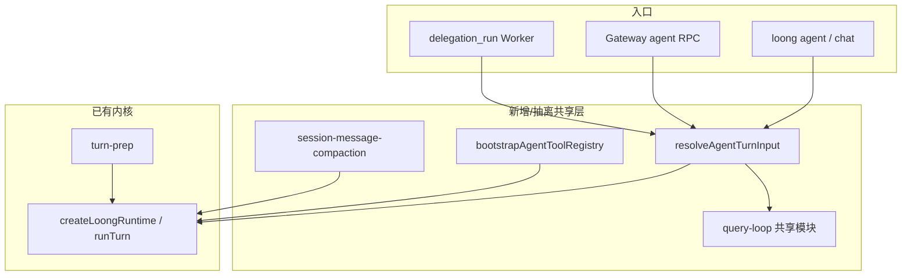

# 能力补齐落地技术方案

> 基于 [README 待补齐能力](../README.md#待补齐的能力) 与当前代码库核对结果编制。  
> **产品定位**：通用 AI Agent（CLI / 网关 / 渠道 / 多智能体），**不包含** IDE 深度集成。

## 1. 目标与原则

| 目标 | 说明 |
|------|------|
| **统一语义** | 会话排队、Query Loop、Profile 解析在 CLI / Gateway / `delegation` 共用同一套模块，避免三处拷贝。 |
| **分层控上下文** | 会话摘要（注入）→ 消息列表压缩（持久化）→ 单轮 Turn Prep（发送前），职责不重叠。 |
| **默认可上线** | 非 loopback 绑定强制认证；直连工具默认只读白名单可配置。 |
| **可验证** | 每项任务在 `@loong/test-suite` 有对应回归或扩展现有 smoke。 |

**建议实施顺序**：P0-1 → P0-3 → P0-2 → P1-2 → P1-1 → P1-3 → P2（可并行）。

---

## 2. 总体架构（补齐后）



---

## 3. P0：会话续跑统一（Epic A）

### 3.1 现状

| 组件 | 文件 | 行为 |
|------|------|------|
| 排队 | `packages/gateway/src/session-coordinator.ts` | 同 `sessionId` 串行；`agent.wait` 取结果 |
| Query Loop | `packages/gateway/src/query-loop.ts` + `#executeAgentTurn` | 仅 Gateway；续跑触发主要为 `queryLoopContinue`（工具触顶） |
| 单次回合 | `packages/core/src/runtime.ts` | `runTurn`；触顶时写 `queryLoopContinue` |
| CLI | `packages/cli/src/index.ts` | 单次 `runTurn`，无 loop |
| 委托 | `packages/delegation/src/index.ts` | 子任务 `runTurn`，无 session 协调 |

### 3.2 方案

1. **抽离共享模块** `packages/core/src/query-loop.ts`（自 gateway 迁出并 re-export）  
   - `resolveQueryLoopMaxTurns`、`shouldContinueQueryLoop`、`QUERY_LOOP_CONTINUE_MESSAGE`  
   - Gateway 改为从 `@loong/core` 引用。

2. **新增 `runTurnWithQueryLoop(runtime, input, options)`**（可放在 `core` 或 `core/session-runner.ts`）  
   - 循环调用 `runTurn`，合并 events/messages；供 CLI、Gateway、测试共用。

3. **扩展续跑触发条件**（`shouldContinueQueryLoop`）  
   - 已有：`assistantMetadata.queryLoopContinue === true`（工具触顶）  
   - 新增：`metadata.forceQueryLoop === true`（Dashboard/CLI 显式「办完为止」）  
   - 新增（可选 P0.5）：助手文本含未完成标记 + 用户消息为任务型（启发式，可配置关闭）

4. **CLI**  
   - `loong agent --query-loop` / `--query-loop-max-turns N`  
   - 默认与 Gateway Dashboard `settings.queryLoop` 对齐。

5. **delegation**  
   - Worker `runTurn` 继承父 `sessionId` 后缀（如 `${parentSessionId}:delegation:${taskId}`），避免与主会话抢 Lane；文档说明与主会话隔离策略。

### 3.3 验收标准

- [ ] `test-suite`：`cli query loop` 与现有 `gateway query loop continuation` 共用 core 实现后仍绿  
- [ ] CLI `--query-loop` 在工具触顶后自动续跑 ≥2 轮  
- [ ] Gateway 行为无回归；`SessionTurnCoordinator` 排队 + loop 可同时工作  
- [ ] `delegation_run` 不阻塞主 session Lane（独立 sessionId）

---

## 4. P0：跨轮上下文治理（Epic B）

### 4.1 现状

| 层级 | 实现 | 局限 |
|------|------|------|
| 注入摘要 | `memory` → `session_compaction` context provider | 不减少发给模型的 tool 消息体积 |
| 单轮裁剪 | `core/turn-prep.ts` | 仅当轮 messages |
| 会话存储 | `core` session store 持久化完整 messages | 长会话 tool 结果堆积 |

### 4.2 方案（三层）

| 层级 | 名称 | 动作 | 模块 |
|------|------|------|------|
| L1 | 会话摘要注入 | 保持现有 `session_compaction` | `memory` |
| L2 | **消息列表压缩** | `runTurn` 前从 session 读取 messages，对早于最近 N 轮的 `tool` 消息做确定性截断/合并；写回 session 或生成「压缩占位」assistant 摘要 | 新建 `packages/core/src/session-message-compaction.ts` |
| L3 | Turn Prep | 保持；`aggressive` 在 L2 之后仍溢出时触发 | `turn-prep.ts` |

**配置**（`.loong/config/agents.json` 或独立 `context.json`）：

```json
{
  "sessionCompaction": {
    "keepRecentTurns": 4,
    "toolResultMaxChars": 2000,
    "summarizeOlderTools": false
  }
}
```

` summarizeOlderTools: true` 为 P1 增强：调用便宜模型生成 tool 块摘要（可选）。

### 4.3 验收标准

- [ ] 伪造 20 轮大 tool 输出的会话，`runTurn` 估计字符数低于阈值且任务仍可完成（test-suite）  
- [ ] L2 与 L1 同时开启时不重复注入矛盾摘要  
- [ ] `turn prep reactive retry` 测试仍通过

---

## 5. P0：网关生产化硬化（Epic C）

### 5.1 现状

- `packages/gateway/src/auth-policy.ts`：`applyProductionAuthDefaults` 已对非 loopback / wildcard 自动生成 `shared-secret`  
- `packages/gateway/src/rate-limit.ts`：HTTP/WS 滑动窗口限速  
- `tool.invoke`：硬编码只读 Git 白名单（`gateway/index.ts`）

### 5.2 方案

1. **配置契约** `.loong/config/gateway.json`  
   - `authMode`、`sharedSecret`、`rateLimits`、`toolInvokeAllowlist`  
   - `loong gateway` 启动时 merge 环境变量与文件；**非 loopback 且无 secret 时拒绝启动**（breaking， major 版本说明）

2. **直连工具策略**  
   - 默认 allowlist：`git_status`、`git_diff`、`git_log`、`file_read`、`file_search`（可配置收紧为仅 git）  
   - Dashboard `tools` 面板标注「直连 / 智能体」差异

3. **部署文档**  
   - 更新 `docs/DEPLOYMENT.md`：反向代理、mTLS 建议、secret 轮换

### 5.3 验收标准

- [ ] 绑定 `0.0.0.0` 无 secret 启动失败并给出明确错误  
- [ ] `test-suite` 已有 auth / rate-limit 用例扩展 allowlist 配置用例  
- [ ] `pnpm smoke:gateway` 在 shared-secret 模式下通过

---

## 6. P1：MCP 一等公民（Epic D）

### 6.1 现状

- `packages/tools/src/mcp/*`：stdio + HTTP、`loadMcpConfig`、`registerMcpTools`  
- **仅 CLI** 在 `createRuntimeBundle` 中加载（`cli/index.ts` ~611 行）  
- **Gateway** `createToolRegistry` 未调用 MCP

### 6.2 方案

1. **抽离** `packages/tools/src/bootstrap-agent-registry.ts`  
   ```ts
   export async function bootstrapAgentToolRegistry(options: {
     cwd: string;
     baseTools: ToolDefinition[];
     mcpConfigPath?: string;
     pluginTools?: ToolDefinition[];
   }): Promise<{ registry: ToolRegistry; mcp: { registered: string[]; errors: string[] } }>
   ```

2. **CLI / Gateway** 均调用；Gateway 启动日志输出 MCP 加载结果。

3. **RPC**（Gateway）  
   - `mcp.servers.list`：返回 id、url/command（掩码）、工具数、错误  
   - `tools.catalog` 标注 `source: "mcp" | "builtin" | "plugin"`

4. **Dashboard**（可选本 Epic）  
   - 系统页展示 MCP 服务状态；智能体页提示「MCP 工具默认需审批」

5. **权限**  
   - MCP 工具保持 `permission: "ask"`；允许 Profile 级 `mcpAllow: string[]` 白名单（P1.5）

### 6.3 验收标准

- [ ] Gateway `agent` 可调用 `mcp_*` 工具（test-suite 扩展现有 `mcp http transport`）  
- [ ] `mcp.servers.list` RPC 不泄露 env 密钥  
- [ ] CLI 与 Gateway 注册工具名一致

---

## 7. P1：配置全链路贯通（Epic E）

### 7.1 现状

- Gateway：`mergeAgentProfile` + `toTurnInput`（`gateway/agent-params.ts`）  
- CLI：`turnInput` 未读 `agents.json` Profile；无 `--profile`  
- Tier：`core/tiers.ts` + Dashboard models 页，部分字段仅 metadata

### 7.2 方案

1. **抽离** `packages/gateway/src/agent-params.ts` → `packages/core/src/agent-resolve.ts`（或新包 `@loong/agent-config`）  
   - `loadAgentConfig(path)`、`mergeAgentProfile(params, profile)`、`toTurnInput(params)`  
   - Gateway / CLI 共用

2. **CLI**  
   - `loong agent --profile <id>`；默认 `defaultProfileId`  
   - 传递 `thinking`、`toolsEnabled`、`memoryEnabled`、`systemPrompt`、`tier`

3. **Dashboard 审计清单**（开发自检表）  
   - Agents 页每个字段 → `agent` RPC 字段 → `LoongTurnInput` → `runtime` 消费点（列成表，逐项勾选）

4. **test-suite**  
   - `cli agent profile toolsEnabled false` 不注册 write 工具  
   - `cli agent profile thinking high` 传入 provider（若 provider 支持）

### 7.3 验收标准

- [ ] CLI 与 Gateway 同一 Profile 行为一致（同一 session 除外）  
- [ ] Dashboard 关闭「工具」后 `tools.catalog` 与 agent 实际不一致问题修复

---

## 8. P1：渠道与多机协同（Epic F）

### 8.1 现状

- `@loong/channels`：Telegram/Slack 解析 + `postGatewayWebhook`  
- 需外部进程转发；无 pairing / 远程 Worker

### 8.2 方案（分阶段）

**F1（本阶段）— 降低 bridge 成本**

- 提供 `loong channels serve`（CLI 子命令）：内嵌轻量 HTTP，转调本地 Gateway webhook（单进程部署模板）  
- 文档：`docs/CHANNELS.md` 单节点拓扑图

**F2 — 配对与多节点（Roadmap 延续）**

- `packages/gateway/src/pairing.ts`：一次性 token、设备列表 RPC  
- 远程 Worker：WebSocket `worker.register` + 工具代理（仅设计文档先行，实现放 Phase 6）

### 8.3 验收标准

- [ ] `loong channels serve` + `loong gateway` 本地联通 Telegram 模拟 payload（test-suite webhook 已有可复用）  
- [ ] 配对 API 设计评审通过（可先 mock 测试）

---

## 9. P2：浏览器与工程效率（Epic G / H）

### Epic G：浏览器

| 任务 | 说明 |
|------|------|
| G1 | `docs/DEPLOYMENT.md` 增加 Playwright 可选安装章节 |
| G2 | `browser_playwright_*` 与轻量 `browser_*` 能力矩阵表写入 `docs/modules/tools.md` |
| G3 | 流式并行读：只读工具并行结果通过 `assistant_delta` 或 `tool` 事件分批推送（可选） |

### Epic H：工程可维护

| 任务 | 说明 |
|------|------|
| H1 | `gateway/index.ts` 拆为 `gateway/http.ts`、`gateway/rpc.ts`、`gateway/agent-handler.ts` |
| H2 | `cli/index.ts` 拆为 `cli/commands/*.ts` |
| H3 | `memory/index.ts` 按 store / compaction / candidates 拆分 |
| H4 | `test-suite` 按域分文件 + `pnpm test` 并行 worker（`--parallel` 或分 package script） |

---

## 10. 任务清单（可跟踪）

状态说明：`[ ]` 待办 · `[~]` 进行中 · `[x]` 完成

### Phase 1 — P0（建议 3–4 周）

| ID | 任务 | 依赖 | 产出/文件 |
|----|------|------|-----------|
| A1 | [x] 将 `query-loop.ts` 迁至 `@loong/core` 并改 Gateway import | — | `core/src/query-loop.ts` |
| A2 | [x] 实现 `runTurnWithQueryLoop` + 单测 | A1 | `core/src/session-runner.ts` |
| A3 | [x] CLI：`--query-loop` / `--query-loop-max-turns` / `--finish-task` | A2 | `cli/src/index.ts` |
| A4 | [x] 扩展 `shouldContinueQueryLoop`（`forceQueryLoop` metadata） | A1 | `core/query-loop.ts` |
| A5 | [x] Dashboard：「办完为止」开关 → `agent` RPC（`finishTask` → `forceQueryLoop`） | A4 | `gateway-dashboard` |
| A6 | [x] delegation 子 sessionId 策略（`${sessionId}:delegate:<taskId>`） | — | `delegation/src/index.ts` |
| A7 | [x] test-suite：CLI `--query-loop` 等 flag 在 help 中可发现 | A3 | `test-suite` |
| B1 | [x] 设计 `session-message-compaction` API | — | `core/session-message-compaction.ts` |
| B2 | [x] 实现 L2 压缩并接入 `prepareSessionHistoryForModel` | B1 | `session-history-prep.ts` + `runtime` |
| B3 | [x] `sessionCompaction`（`context.json` + `agents.json` 全局/Profile） | B2 | `core/session-compaction-config.ts` |
| B4 | [x] test-suite：长会话 tool 堆积场景 | B2 | `test-suite` |
| C1 | [x] `gateway.json` schema + 启动合并 | — | `cli/gateway-settings.ts` |
| C2 | [x] `requireExplicitSecret` 时非 loopback 无 secret 拒绝启动 | C1 | `gateway/index.ts` `normalizeConfig` |
| C3 | [x] 可配置 `toolInvokeAllowlist` | C1 | `gateway/index.ts` |
| C4 | [x] 更新 `DEPLOYMENT.md` | C2 | `docs/DEPLOYMENT.md` |
| C5 | [x] test-suite：allowlist + 启动失败用例 | C2,C3 | `test-suite` |

### Phase 2 — P1（建议 4–5 周）

| ID | 任务 | 依赖 | 产出/文件 |
|----|------|------|-----------|
| D1 | [x] `bootstrapAgentToolRegistry` 抽离 | — | `cli/bootstrap-agent-tool-registry.ts` |
| D2 | [x] Gateway 使用含 MCP 的 `toolRegistry` | D1 | `cli` 传 `toolRegistry` |
| D3 | [x] RPC `mcp.servers.list` | D2 | `gateway` |
| D4 | [x] `tools.catalog` 标注 source | D2 | `gateway` |
| D5 | [x] test-suite：Gateway MCP agent 调用 | D2 | `test-suite` |
| E1 | [x] `agent-profile` 模块（profile → TurnInput） | — | `core/agent-profile.ts` |
| E2 | [x] CLI `--profile` + 合并逻辑 | E1 | `cli` |
| E3 | [x] Dashboard：profileId 贯通 + finishTask/queryLoopMaxTurns | E1 | `gateway-dashboard` |
| E4 | [x] test-suite：profile merge | E2 | `test-suite` |
| F1 | [x] `loong channels serve` 子命令 | — | `cli/channels-serve.ts` |
| F2 | [x] `docs/CHANNELS.md` 部署拓扑 | F1 | `docs` |
| F3 | [x] pairing RPC + `docs/PAIRING.md` | — | `gateway/pairing.ts`, `docs/PAIRING.md` |

### Phase 3 — P2（持续）

| ID | 任务 | 依赖 |
|----|------|------|
| G1 | [x] Playwright 安装与能力矩阵文档 | — |
| G2 | [x] 流式并行读（`tool` phase `update` + `parallelBatch`） | G1 |
| H1 | [~] 拆分 `gateway/index.ts`（+ `gateway-rpc-parse.ts`、`gateway-rpc-types.ts`、`gateway-rpc-params.ts`） | P0 稳定后 |
| H2 | [~] 拆分 `cli`（`index.ts` 入口 + `cli-impl.ts` + `runtime-factory.ts` + `commands/{cron,gateway,chat}.ts` + `chat-args`/`attachments`/`cli-ui`） | — |
| H3 | [x] 拆分 `memory/index.ts`（store/helpers、candidates、trajectory、context、tools；index 仅 re-export） | — |
| H4 | [x] test-suite：`lib/test-helpers.ts` + `suites/{cli,runtime,gateway}.tests.ts` + `registry` + `test:shards` | — |
| H1 | [~] `gateway-http*.ts` + `gateway-websocket.ts` + `gateway-rpc-handler.ts` + `gateway-agent-turn.ts` + `gateway-event-stream.ts` + `gateway-connection-hub.ts`（WS/SSE 连接与事件广播）；index 保留 gateway 类编排 | — |

---

## 11. 风险与依赖

| 风险 | 缓解 |
|------|------|
| P0 行为变更（强制 auth）破坏本地开发 | loopback 默认仍 `none`；仅非 loopback 强制 |
| Query Loop 烧 token | 默认 `maxTurns=3`；Dashboard 显式提示 |
| L2 压缩丢关键 tool 信息 | 保留最近 N 轮完整 tool；仅压缩更早轮次 |
| 大文件拆分引入回归 | 先纯移动无逻辑变更 PR，再功能 PR |

---

## 12. 相关文档

- [README · 待补齐的能力](../README.md#待补齐的能力)
- [ROADMAP.md](./ROADMAP.md)
- [ARCHITECTURE.md](./ARCHITECTURE.md)
- [DEPLOYMENT.md](./DEPLOYMENT.md)
- [modules/tools.md](./modules/tools.md)
