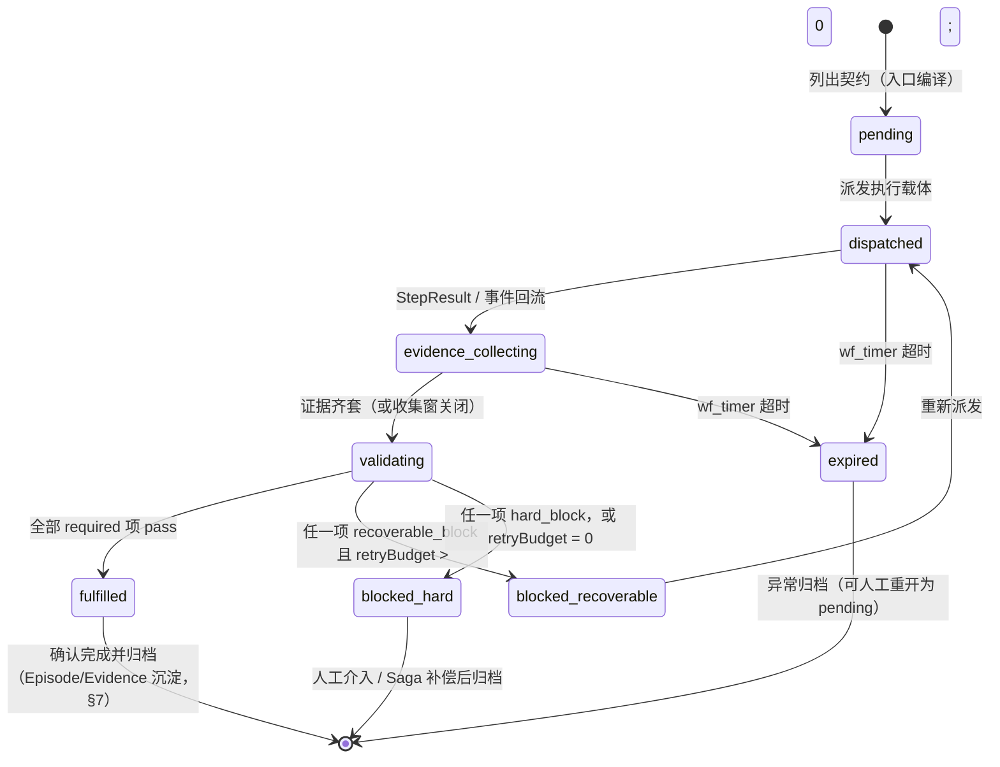
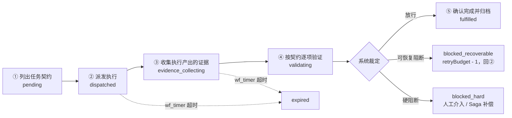

# 任务契约（Obligation）+ 执行证据链（Evidence Chain）落地设计

> 版本：v0.1（Phase 3 落地设计草案）
> 关联：[DETERMINISTIC_ORCHESTRATION_DESIGN.md](./DETERMINISTIC_ORCHESTRATION_DESIGN.md)（Phase 0–2）· [ONTOLOGY_MEMORY_REQUIREMENTS.md](./ONTOLOGY_MEMORY_REQUIREMENTS.md)（FR-04/FR-07/FR-12）· [research/harness-engineering-pku.txt](./research/harness-engineering-pku.txt)
> 目标读者：Loong 内核 / Gateway 维护者、ClawWorks-Server 编排面实现者

---

## 1. 结论与目标

### 1.1 一句话结论

Phase 3 = 在 Phase 0–2「确定性编排」之上补一层**验收机制**：
**用 Obligation（任务契约）统一声明「需要完成什么、满足哪些条件才算完成」**
**+ 用证据链把执行产出（`wf_event` / `ontology_evidence` / `StepResult`）归集到契约名下**
**+ 由系统验证器按契约逐项裁定三态（放行 / 可恢复阻断 / 硬阻断），而不是靠模型一句「我做完了」推进状态**。

概念直接取自北大 Harness Engineering 报告：六种环节执行链（Request → Decision → Action → Evidence → Validation → Audit Log）、Obligation 四种可独立校验身份、五步完成链路、三类断裂点、「约束层小而稳，判断留给 Agent」（PAGE 52–56）。本设计是报告三层模型中 **Quality Gate** 在 Loong 的具体落子。

Loong 推理内核与 Phase 0–2 编排资产（`step.execute` / `wf_*` / 闸门与审批链）**一行不重写**，契约与验证以外置服务叠加。

### 1.2 目标

| 维度 | 目标 |
|------|------|
| 完成可验证 | 「完成」由契约验收项 + 外部证据裁定，不由执行者自证（报告：「完成」不能自证） |
| 链路无断裂 | 三类断裂点（无人接手 / 长期无响应 / 无验收）都有 durable 兜底与终态 |
| 证据可归集 | 每次执行的产出以逻辑外键挂到契约名下，可逐项核对 |
| 判定可解释 | 任一契约可回答「为什么算做完 / 不算做完」，全链路可溯源 |
| 约束小而稳 | 验证器只做机器可稳定验证的事；探索与推理留在 Agent 侧，契约机制不随任务复杂度膨胀 |

### 1.3 非目标

- 不重写 Phase 0–2 的编排面（FSM/Temporal 过渡、四道闸门、审批桥接）。
- 不做「所有任务全契约化」——纯问答、闲聊类请求不产生契约（见 §12 R2 的契约编译边界）。
- 不让模型评审拥有裁决权——模型评审只产出佐证，不可单独定论（§6.1）。
- 本阶段不实现 Loop Engineering 的 Self-Feeding（自动发现/派发新任务），只做退出条件与预算的预留（§8）。

---

## 2. 现状问题（基于真实代码）

对照报告 PAGE 54 的三类断裂点，Loong 当前代码逐条命中：

| 报告断裂点 | Loong 现状证据 | 后果 |
|-----------|----------------|------|
| 路由完成，但无人接手 | webhook / agent RPC 进入 `SessionTurnCoordinator.runOrEnqueue()`（`packages/gateway/src/session-coordinator.ts`），执行完返回 `AgentTurnResultPayload` 即终态；`step.execute` 返回 `GatewayStepResult` 后由调用方自行处置 | 结果无人认领，任务停在「执行完了但没人说算不算数」的中间态 |
| 任务派发，但长期无响应 | 会话队列是纯进程内结构（`#queues` / `#waiters` / `#activeSessions` 均为内存 Map），`waitForQueuedTurn()` 只有 600s 内存超时；durable `wf_timer` 只存在于 ClawWorks-Server 侧（Phase 1） | 进程重启即丢、执行沉默无超时检测与恢复 |
| 结果返回，但没有验收 | `shouldContinueQueryLoop()`（`packages/core/src/query-loop.ts`）以 assistant 消息自报的 `queryLoopDone` / `queryLoopContinue` metadata 为续跑/停止依据；`GatewayStepResult.status: "ok"` 由执行路径直接给出 | 「完成」靠模型自证，任务状态被错误推进 |

另有一条横切问题：**裁判与运动员未分离**。续跑与否由执行者（assistant message metadata）自报，系统内不存在独立验收方——对应报告 PAGE 47「不能让同一个模块既当运动员又当裁判」。

补充证据：`stepParamsFromRequest()`（`packages/gateway/src/gateway-step-execute.ts`）把 step 请求编译为 `queryLoop: false`、`memoryEnabled: false` 的无状态单步——Phase 0 解决了「编排者/执行者分离」，但**执行结果回来之后由谁验收**仍是空白。Phase 3 填的就是这个空白。

**结论**：Phase 0–2 让 Loong「正确地做事」（确定性流转），Phase 3 让系统能判定「事情算不算做完」。报告 PAGE 54 核心结论原样适用：问题并非能力不足，而是缺少将「应该完成」转化为「必须经过验证才能完成」的机制。

---

## 3. 核心模型：Obligation 任务契约

### 3.1 类型定义

```ts
/** 契约状态机（三态裁定的载体）。 */
export type ObligationStatus =
  | "pending"               // 已列出契约，待派发
  | "dispatched"            // 已派发执行载体，待回执
  | "evidence_collecting"   // 执行产出回流，证据收集中
  | "validating"            // 按契约逐项验证中
  | "fulfilled"             // 放行：全部 required 验收项通过，已归档
  | "blocked_recoverable"   // 可恢复阻断：补证据/重试后可再验证
  | "blocked_hard"          // 硬阻断：需人工介入或 Saga 补偿
  | "expired";              // 超时未收敛（wf_timer 兜底）

/** 单项验收裁定（三态，对应报告 PAGE 48/52）。 */
export type ObligationVerdict = "pass" | "recoverable_block" | "hard_block";

/** 验证器类型（§6.1）。 */
export type ObligationValidatorKind =
  | "schema"           // 结构校验（复用 suite schema 闸门）
  | "tool_assertion"   // 工具结果断言（确定性表达式）
  | "test_command"     // 测试命令执行（exit code，沙箱内）
  | "human_confirm"    // 人工确认（复用审批链）
  | "model_review";    // 模型评审（辅助，不可单独定论）

/** 验收项：契约的「完成标准」最小单元。 */
export interface ObligationItem {
  id: string;
  obligationId: string;
  seq: number;                         // 验收项顺序
  acceptance: string;                  // 验收项陈述（"满足哪些条件"）
  validator: ObligationValidatorKind;
  validatorConfig: Record<string, unknown>; // schemaRef / 断言表达式 / 命令 / 审批链 / rubric
  required: boolean;                   // false = 建议项，不阻断 fulfilled
  deadlineAt?: string;                 // 项级超时（wf_timer signal）
  verdict?: ObligationVerdict;
  verdictReason?: string;
  validatedAt?: string;
}

/** 任务契约：一份「施工合同 + 验收清单」（报告 PAGE 29）。 */
export interface Obligation {
  id: string;
  // —— 身份一：请求归属 ——
  tenantId: string;
  employeeId: string;
  requesterUserId?: string;            // 渠道侧真实用户（纯系统任务可空）
  source: string;                      // 入口渠道：rpc / webhook / orchestration / cron
  // —— 身份二：任务契约 ——
  statement: string;                   // 任务声明："需要完成什么"
  items: ObligationItem[];             // 验收项清单（完成标准）
  budget?: { maxTokens?: number; maxCostUsd?: number }; // 契约级预算硬限（§8）
  deadlineAt?: string;                 // 契约级超时
  // —— 身份三：执行载体 ——
  instanceId?: string;                 // wf_instance.id（编排面派发时回填）
  runId?: string;                      // GatewayStepResult.runId / 渠道 run
  idempotencyKey?: string;             // step.execute 幂等键（重放归并）
  // —— 状态与裁定 ——
  status: ObligationStatus;
  retryBudget: number;                 // 可恢复阻断剩余重试次数（错误放大防护）
  createdAt: string;
  updatedAt: string;
  fulfilledAt?: string;
}

/** 证据指针：跨 store 逻辑外键（§5.2），不做 DB 级 FK。 */
export type ObligationEvidenceRef =
  | { kind: "wf_event"; instanceId: string; seq: number }
  | { kind: "ontology_evidence"; tenantId: string; userId: string; evidenceId: string }
  | { kind: "ontology_episode"; tenantId: string; userId: string; episodeId: string }
  | { kind: "step_result"; idempotencyKey: string };  // wf_idempotency_key.result 快照
```

### 3.2 状态机



状态迁移全部写 `wf_event`（`type = ObligationCreated / ObligationStatusChanged / ObligationVerdictRecorded`），`obligation` 表只是当前态投影——与 `wf_instance` / `wf_event` 的关系同构，replay 可重建（§10）。

### 3.3 与 StepRequest / StepResult 的关系

概念名 `StepRequest` / `StepResult`（《确定性编排》§5.2）在代码中的实际类型是 `GatewayStepExecuteParams` / `GatewayStepResult`（`packages/gateway/src/gateway-step-types.ts`）。两者与 Obligation 的关系：

- **StepRequest 是「执行载体」层的单次调用契约**（`idempotencyKey` 必填、`mode: "propose" | "tool"`、`budget?` 等）；**Obligation 是「任务」层契约**，一次任务可跨越多次 `step.execute`（多步编排、可恢复阻断重试）。
- **`GatewayStepResult.status: "ok"` 只证明「这次执行没出错」**（usage/events 正常返回），它只能作为一条 Evidence 进入收集环节（`step_result` 指针），**不允许直接推进契约状态**。
- 一句话：**StepResult 是证据，不是裁定**。裁定只能由 §6 的验证器体系给出。

### 3.4 四种可独立校验身份的落库

报告 PAGE 53 的四身份在 Loong 各有唯一落点，可分别独立校验：

| 身份 | 报告定义 | Loong 落点 |
|------|---------|-----------|
| 请求归属 | 谁提出这次任务 | `obligation.tenant_id / employee_id / requester_user_id / source` |
| 任务契约 | 任务必须满足哪些验收项 | `obligation.statement` + `obligation_item`（§5.1） |
| 执行载体 | 具体是哪一次执行在处理任务 | `obligation.instance_id / run_id / idempotency_key` ↔ `wf_instance.id`、`GatewayStepResult.runId` |
| 事实记录 | 关联 Memory / State / Event System 中的状态变化和事件记录 | `wf_event`（编排事件流）+ `ontology_evidence` / `ontology_episodes`（记忆证据原文）+ `ontology_audit_log`（审计） |

只有状态记录能回答「发生了什么」，回答不了「这件事算不算做完」——Obligation 补上的正是验收标准（报告 PAGE 53 原文立意）。

---

## 4. 六环节执行链在 Loong 的落点

报告 PAGE 52 把抽象执行链拆为六环节，并把「请求接入 → 路由判定 → 状态记录 → 任务编译 → 执行准入 → 验收核对」逐步收归系统。对照落点：

| 环节 | 报告拆解 | Loong / Server 落点 | 现状 | Phase 3 动作 |
|------|---------|--------------------|------|-------------|
| Request | 请求接入 | Gateway agent RPC / webhook（`executeGatewayAgentTurn`，`packages/gateway/src/gateway-agent-turn.ts`）、`step.execute` RPC | ✅ 已有 | 入口编译契约（statement + items），写 `obligation` pending |
| Decision | 路由判定 + 任务编译 | `mode: "propose"` 产出 proposal；`gateEvaluationService` schema 闸门；`policyEngineService` 策略闸门 | ✅ Phase 1 已有 | 判定结果与派发记录挂到契约（执行载体回填） |
| Action | 执行准入（放行 / 可恢复阻断 / 硬阻断后才执行）+ 执行 | `mode: "tool"`；`sideEffectActivityService`（幂等键兜底）；`sagaCompensationService` | ✅ Phase 1 已有 | 副作用继续走 `wf_idempotency_key`；执行开始即写证据链起点 |
| Evidence | 状态记录（写入 Memory + State + Event System） | `wf_event`（Server MySQL）；`ontology_evidence` / `ontology_episodes`（Loong SQLite） | ⚠️ 分散在两处 | 新增 `obligation_evidence_link` 统一归集（§5） |
| Validation | 验收核对（核对证据、报告与状态记录是否一致，由系统裁定） | **无** | ❌ 缺失 | 新增 `obligationValidationService`（§6），三态裁定 |
| AuditLog | 全程留痕 | `ontology_audit_log`（append-only）；`wf_event`；WORM 审计（《确定性编排》§11） | ⚠️ 部分 | verdict 与状态迁移全量留痕（§9） |

五步完成链路（报告 PAGE 53）与状态机的对应：



五步串联形成可验证、可追溯的完成链路，而不是靠模型一句「我做完了」结束任务。

---

## 5. 存储设计

### 5.1 新表（ClawWorks-Server MySQL，与 `wf_*` 同库同风格）

```sql
-- 任务契约（当前态投影；事件溯源在 wf_event）
CREATE TABLE obligation (
  id              CHAR(36) PRIMARY KEY,
  tenant_id       VARCHAR(64)  NOT NULL,
  employee_id     VARCHAR(64)  NOT NULL,
  requester_user_id VARCHAR(64) NULL,
  source          VARCHAR(32)  NOT NULL,   -- rpc / webhook / orchestration / cron
  statement       TEXT         NOT NULL,   -- 任务声明
  status          ENUM('pending','dispatched','evidence_collecting','validating',
                       'fulfilled','blocked_recoverable','blocked_hard','expired') NOT NULL,
  instance_id     CHAR(36)     NULL,       -- wf_instance.id
  run_id          VARCHAR(64)  NULL,
  idempotency_key VARCHAR(160) NULL,       -- step.execute 幂等键（重放归并）
  budget_json     JSON         NULL,
  deadline_at     DATETIME(3)  NULL,
  retry_budget    INT          NOT NULL DEFAULT 2,
  fulfilled_at    DATETIME(3)  NULL,
  created_at      DATETIME(3)  NOT NULL,
  updated_at      DATETIME(3)  NOT NULL,
  KEY idx_tenant_status (tenant_id, status),
  KEY idx_instance (instance_id),
  KEY idx_idempotency (idempotency_key)
);

-- 验收项（完成标准的最小单元）
CREATE TABLE obligation_item (
  id              CHAR(36) PRIMARY KEY,
  obligation_id   CHAR(36)     NOT NULL,
  seq             INT          NOT NULL,
  acceptance      TEXT         NOT NULL,
  validator       VARCHAR(32)  NOT NULL,   -- schema / tool_assertion / test_command / human_confirm / model_review
  validator_config JSON        NOT NULL,
  required        TINYINT      NOT NULL DEFAULT 1,
  deadline_at     DATETIME(3)  NULL,
  verdict         VARCHAR(24)  NULL,       -- pass / recoverable_block / hard_block
  verdict_reason  TEXT         NULL,
  validated_at    DATETIME(3)  NULL,
  UNIQUE KEY uk_obligation_seq (obligation_id, seq)
);

-- 证据链：契约/验收项 ↔ 跨 store 证据指针
CREATE TABLE obligation_evidence_link (
  obligation_id   CHAR(36)     NOT NULL,
  item_id         CHAR(36)     NULL,       -- NULL = 契约级证据
  kind            VARCHAR(24)  NOT NULL,   -- wf_event / ontology_evidence / ontology_episode / step_result
  ref_hash        CHAR(64)     NOT NULL,   -- sha256(canonical ref_json)，归集去重
  ref_json        JSON         NOT NULL,   -- 逻辑外键指针（§5.2）
  collected_at    DATETIME(3)  NOT NULL,
  PRIMARY KEY (obligation_id, ref_hash),
  KEY idx_item (item_id)
);
```

### 5.2 真相源边界（不双写）

| 数据 | 真相源 | 说明 |
|------|-------|------|
| 契约状态、裁定、派发记录 | ClawWorks-Server MySQL（`obligation*` + `wf_event`） | 编排事实唯一真相源，replay 可重建 |
| 证据原文、记忆沉淀 | Loong ontology store（`ontology_evidence` / `ontology_episodes`，SQLite） | 记忆事实唯一真相源，`excerpt` 不出 Loong 进程边界 |
| 关联关系 | `obligation_evidence_link` 只存指针 | **逻辑外键**：跨库无 DB 级 FK；写入方保证完整性，读方容忍悬空引用并记审计 |

两条铁律（对应 §12 R6）：

1. **证据原文不复制进 MySQL**——`excerpt` 可能含个人信息，遵循最小化（对齐 `ontology_audit_log` 的 `detail_json` 只存元数据的姿态）。
2. **契约状态不写入 `ontology_assertions`**——断言库存「关于用户/世界的事实」，契约裁定是「关于任务执行的事件」，混写会污染置信度体系（§7）。

---

## 6. 验证器体系（Validation）

### 6.1 五类验证器

| 验证器 | 判定依据 | 复用 / 新增 | 可单独定论 |
|--------|---------|------------|-----------|
| `schema` | 产出对 suite schema 的结构校验 | 复用 `gateEvaluationService` / `suiteSchemaLoaderService` | ✅ |
| `tool_assertion` | 对 `toolResult` / `proposal` 的确定性表达式（相等 / 区间 / 存在性 / 正则） | 新增纯函数求值器 | ✅ |
| `test_command` | 沙箱内执行命令，exit code == 0（对应报告 Unit / Integration Test / Build 验证回路） | 新增，遵循 step `allowedTools` 与预算 | ✅ |
| `human_confirm` | 审批工单通过 / 驳回 | 复用 `workflowApprovalBridgeService` + `approvalController` 回调 signal | ✅ |
| `model_review` | rubric 打分 ≥ 阈值 | 新增 | ❌ 只产出佐证，契约中必须搭配至少一个确定性验证器 |

模型评审不可单独定论——报告两条建议原样适用：「Skill 提供方法与证据，但不该拥有裁决权」「强能力不等于可直接信任，输出须先转化为可验证、可审查的形式」。

### 6.2 三态裁定语义

| 裁定 | 语义 | 系统动作 |
|------|------|---------|
| `pass`（放行） | 验收项通过 | 全部 required 项 pass → 契约 `fulfilled`，确认完成并归档（§7 沉淀） |
| `recoverable_block`（可恢复阻断） | 证据不足 / 可重试错误（如测试命令超时、证据缺失） | `retry_budget > 0`：扣减后回 `dispatched` 重新派发；`retry_budget = 0`：升级为 `hard_block` |
| `hard_block`（硬阻断） | 明确失败 / 越权 / 预算超支 | 契约 `blocked_hard`，不自动重试；人工介入或 `sagaCompensationService` 补偿候选 |

「可恢复阻断」是错误放大的防火墙上限：重试次数有硬顶，避免无效重试空转（对应报告「执行失控与无限循环」警示）。

### 6.3 超时与 durable timer

- 项级 `deadline_at` 与契约级 `deadline_at` 都落 `wf_timer`（`signal = "obligation.timeout"`），由 Phase 1 已有的 `wfTimerWorker` 轮询唤醒——复用 durable timer，不新增进程内 `setTimeout`。
- 项级超时 → 该项 `recoverable_block`（可配置为 `hard_block`）；契约级超时 → `expired`。
- 由此补齐 §2 第二类断裂点：**派发后长期无响应 100% 有 durable 兜底**，不再依赖内存队列的 600s 超时。

---

## 7. 与本体记忆（Ontology Memory）联动

终态（`fulfilled` / `blocked_hard`）归档时，验收记录沉淀进 Loong ontology store：

- 写一条 `OntologyEpisode`（`sessionId` / `runId` 关联执行载体，`summary` = 裁定摘要）——原始交互记录层。
- 写一条 `OntologyEvidence`（`source = "obligation-verdict"`，`excerpt` = 验收报告摘要）——可溯源证据层。
- 系统任务 `requesterUserId` 为空时，`identity.userId` 以 `employee:{employeeId}` 命名空间兜底（§12 R4）。
- **边界**：契约裁定本身不进 `ontology_assertions`；但执行中观察到的用户/世界事实（如「用户偏好某流程」）仍走 FR-04 candidate 流程，其 `evidenceIds` 可引用本次验收证据。
- **解释链复用 FR-12**：`explainAssertion()` 已聚合 assertion + evidence + episodes + supersedes + audit（`packages/memory/src/ontology/ontology-user-control.ts` 的 `OntologyAssertionExplanation`）。Phase 3.2 新增同构的 `explainObligation()`：契约 → 验收项 → 证据指针（解引用 `ontology_evidence` 原文）→ verdict → `ontology_audit_log` 审计历史，一次调用回答「这件事为什么算做完 / 不算做完」。

---

## 8. Loop Engineering 预留

报告 PAGE 9：Loop = Harness + Timer + Self-Feeding + Helpers；需警惕 Token 成本、退出条件设计、错误放大。本设计不实现 Loop，但把三个预留点做到位：

| Loop 要素 | 预留 |
|-----------|------|
| 退出条件（Stopping Rules） | **契约即退出条件**：Loop 的停止信号 = obligation 进入终态（`fulfilled` / `blocked_hard` / `expired`），替代 assistant 自报 `queryLoopDone`（`query-loop.ts`）的启发式。终态 signal 供 `WorkflowEnginePort` / 未来 Loop 消费 |
| 预算硬限 | 单步预算已有 `GatewayStepExecuteParams.budget`（`maxTokens` / `maxCostUsd`）；`obligation.budget` 聚合**跨 step 累计**，超支 → `hard_block` |
| 错误放大防护 | `retry_budget` 重试硬顶 + `wf_timer` 超时硬顶，双保险 |

对照报告三层模型 `Constraints → Execution Loop → Quality Gate`：Phase 0–2 交付 Constraints（四道闸门）与可控 Execution Loop 的底座，Phase 3 交付 Quality Gate——三层齐备后，Loop Engineering 才有安全的落点。

---

## 9. 安全与多租户

- **identity 强制**：`obligation` 全表强制 `tenant_id + employee_id`（对齐 `wf_instance`）；证据侧强制 `MemoryIdentity { tenantId, userId, agentInstanceId? }`（`ontology_evidence` 主键即 `(tenant_id, user_id, id)`，租户隔离内建）。
- **跨租户不可见**：obligation 全部查询以 `tenant_id` 前置过滤；`obligation_evidence_link` 解引用时按 identity 过滤——跨租户 / 悬空引用一律视为无效证据，记 `ontology_audit_log` 后跳过（不解引用、不报错泄露）。
- **验证器不扩权**：`test_command` 在沙箱执行，遵循该 step 的 `allowedTools` 与预算；验证器禁止以「验收」名义获得超出执行步骤本身的权限。
- **审计姿态**：状态迁移与 verdict 写 `wf_event` + `ontology_audit_log`（append-only）；审计 `detail_json` 只存指针与裁定元数据，**不复制 `excerpt` 原文**——对齐《确定性编排》§11 的 WORM 与最小化姿态，记录「为什么」而不搬运「是什么」。

---

## 10. 量化验收标准

| 指标 | 目标 |
|------|------|
| 契约覆盖率 | Phase 3.1 起，`step.execute` 产生的副作用类任务 100% 挂接 obligation |
| 自证完成率 | `fulfilled` 契约中「零确定性验证器通过」的占比 = 0（模型评审不可单独定论） |
| 断裂点兜底 | 派发后 `deadline_at` 内无回执的契约，100% 由 `wf_timer` 唤醒进入 `expired` / 阻断，无静默悬挂 |
| 幂等 | 同一 `idempotencyKey` 重放不产生第二条 obligation（`idx_idempotency` 去重） |
| 证据完备 | `fulfilled` 契约的每个 required 项 ≥ 1 条 `obligation_evidence_link` |
| 可解释 | `explainObligation()` 返回全链路（契约→项→证据→裁定→审计），单租户本地 p95 < 200ms |
| 越权 | 跨租户证据解引用成功率 = 0，且每次尝试都有审计记录 |
| 重启恢复 | Server / Loong 重启后，obligation 状态可由 `wf_event` replay 重建，与投影表一致 |

---

## 11. 演进路线

### Phase 3.0 — 契约落库与证据归集（先记录，不裁定）

- [ ] `obligation` / `obligation_item` / `obligation_evidence_link` DDL 上线（与 `wf_*` 同库）。
- [ ] `step.execute` 入口编译契约：`statement` 由 `intent` / `message` 生成，`items` 缺省 1 条 `tool_assertion` 占位；suite 可在 schema 旁声明验收项模板。
- [ ] `wf_event` 写 `ObligationCreated` / `ObligationStatusChanged`；状态推进到 `evidence_collecting` 为止（本阶段不做裁定，只归集证据链）。

### Phase 3.1 — 验证器体系与三态裁定

- [ ] `obligationValidationService`：`schema` / `tool_assertion` / `human_confirm` 先行，`test_command` / `model_review` 随后。
- [ ] 三态裁定 + `retry_budget` + `wf_timer` 超时兜底全量接入。
- [ ] 「`ok` 即终态」路径下线：`step.execute` 调用方必须消费 verdict（或显式声明该任务无需契约）。

### Phase 3.2 — 记忆沉淀与解释链

- [ ] 终态沉淀 `OntologyEpisode` / `OntologyEvidence`（§7）。
- [ ] `explainObligation()` 对外暴露（FR-12 同构解释链）。
- [ ] Loop 退出条件对接：契约终态 signal 供编排面 / 未来 Loop 作为 Stopping Rule 消费（§8）。

---

## 12. 风险与未决

| 编号 | 议题 | 当前倾向 |
|------|------|---------|
| R1 | 幂等表命名不一致：Phase 1 清单用 `wf_idempotency_key`，《确定性编排》§8 DDL 落为 `idempotency_key` | 本文档统一按 `wf_idempotency_key` 引用；Phase 3.0 前统一两侧 DDL 与文档 |
| R2 | 契约编译质量：自然语言 → 验收项的编译可能空泛（缺省占位项无实际约束力） | 先模板化（suite 声明验收项），模型编译仅辅助；契约覆盖率指标只统计带确定性验证器的契约 |
| R3 | `test_command` 验证器的沙箱成本与安全面 | 先只读命令白名单；写入类命令必须走 `human_confirm` 组合 |
| R4 | 系统任务 `requesterUserId` 为空时证据沉淀的 `user_id` 归属 | 以 `employee:{employeeId}` 命名空间兜底，待产品确认 |
| R5 | `model_review` 阈值随模型版本漂移 | 只作佐证；阈值变更走 golden set 回归（《确定性编排》§11 Eval） |
| R6 | 双写边界腐化（excerpt 混进 MySQL / verdict 混进断言库） | §5.2 两条铁列入 code review 卡点；`obligation_evidence_link` 只存指针从结构上防呆 |

---

> 本文档为 Phase 3 落地设计草案；Phase 3.0 可独立交付验证（先记录不裁定），后续按 §12 逐项收敛。
