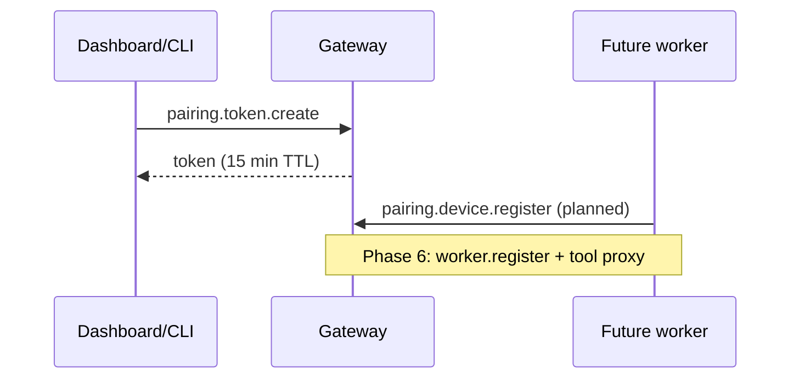

# Device pairing (Gateway)

Dragon Gateway supports **local device pairing** for future multi-node workers. Pairing is file-backed under `.dragon/pairing/devices.json`.

## RPC (requires Gateway authentication when `shared-secret` is enabled)

| RPC | Params | Returns |
|-----|--------|---------|
| `pairing.token.create` | `{ label?: string, ttlMs?: number }` | `{ token, expiresAt }` one-time pairing code |
| `pairing.device.register` | `{ token: string }` | `{ device: { id, label, createdAt, lastSeenAt? } }` |
| `pairing.devices.list` | — | `{ devices: [{ id, label, createdAt, lastSeenAt? }] }` |
| `pairing.device.revoke` | `{ deviceId: string }` | `{ revoked: boolean }` |

## Flow



**Current release**: token creation, device list, and revoke are implemented. Remote workers that consume tokens and register for tool execution are planned (see [GAP_CLOSURE_PLAN.md](./GAP_CLOSURE_PLAN.md) Epic F2).

## Example

```bash
# With gateway running and secret configured
curl -s http://127.0.0.1:17357/rpc \
  -H "Authorization: Bearer $DRAGON_GATEWAY_SECRET" \
  -H "Content-Type: application/json" \
  -d '{"type":"pairing.token.create","id":"1","params":{"label":"office-node"}}'
```
