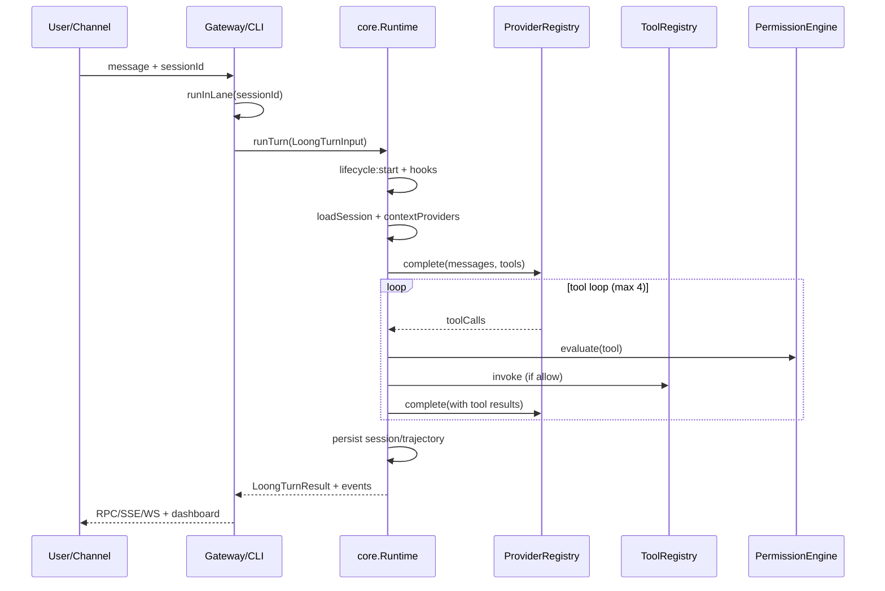

# Loong 整体技术方案

本文档描述 Loong框架的**整体技术架构**、**运行时数据流**、**包依赖关系**与**跨模块 Code Review 结论**。分模块技术方案与逐包 Review 见 [modules/README.md](./modules/README.md)。

> 产品定位与包职责概览仍见 [ARCHITECTURE.md](./ARCHITECTURE.md)；本文侧重实现级技术方案与工程质量评估。

---

## 1. 系统定位

Loong 是 **TypeScript 原生、本地优先（local-first）** 的智能体框架，目标融合：

| 来源 | 借鉴能力 |
|------|----------|
| Loong 原生运行时 | Gateway、插件、会话、Cron、Provider、安全边界 |
| Hermes Agent | 技能自改进、记忆、轨迹、Provider 路由（概念用 TS 重写） |
| Claude Code | 编码 Agent 交互、权限体验、工程工作流（仅作产品研究，不抄源码） |

**硬性约束**：运行时仅 TypeScript/Node，不引入 Python 运行时。

---

## 2. 逻辑分层架构

```text
┌─────────────────────────────────────────────────────────────────┐
│  接入层 (Interfaces)                                             │
│  CLI (loong chat|agent|gateway|cron)  │  Dashboard  │  Webhook  │
└────────────────────────────┬────────────────────────────────────┘
                             │
┌────────────────────────────▼────────────────────────────────────┐
│  控制面 (@loong/gateway)                                        │
│  HTTP / SSE / WebSocket │ JSON-RPC │ Session Lane │ Run Registry │
└────────────────────────────┬────────────────────────────────────┘
                             │
┌────────────────────────────▼────────────────────────────────────┐
│  编排层 (@loong/cli) — Composition Root                         │
│  插件加载 │ Provider/Model 配置 │ 工具注册 │ 记忆/技能/委托装配      │
└────────────────────────────┬────────────────────────────────────┘
                             │
┌────────────────────────────▼────────────────────────────────────┐
│  运行时内核 (@loong/core)                                       │
│  runTurn: 上下文 → 模型 → 工具循环 → 事件 → 持久化                 │
└──────┬──────────────────┬──────────────────┬────────────────────┘
       │                  │                  │
       ▼                  ▼                  ▼
┌──────────────┐  ┌──────────────┐  ┌──────────────────────────────┐
│ @loong/     │  │ @loong/     │  │ @loong/memory + skills +    │
│ providers    │  │ tools        │  │ delegation + cron + channels │
│ model-catalog│  │ security     │  │ (能力扩展，经 CLI 注入)        │
└──────────────┘  └──────────────┘  └──────────────────────────────┘
```

### 2.1 设计原则（实现级）

| 原则 | 落地方式 |
|------|----------|
| 协议优先 | `LoongTurnInput`、`GatewayRequest`、`ToolDefinition` 等 Typed 契约 |
| 可插拔 | `LoongSessionStore`、`LoongContextProvider`、`ModelProvider`、插件 SDK |
| 权限中介 | `ToolPermissionEngine` + 可选 `LoongPermissionHandler` |
| 可审计记忆 | Markdown 文件 + JSONL + 候选记忆审核流 |
| 密钥安全 | `@loong/security` 统一脱敏；Gateway 配置 API 不回传 raw API Key |
| 本地优先 | 默认 `127.0.0.1`、工作区路径约束、无云依赖 |

---

## 3. 核心数据流

### 3.1 Agent 回合（Turn）生命周期



关键实现：`packages/core/src/runtime.ts` 中 `DefaultLoongAgentRuntime.runTurn`。

### 3.2 Gateway 请求路径

| 路径 | 方法 | 用途 |
|------|------|------|
| `/` `/dashboard` | GET | 内嵌 Dashboard SPA |
| `/health` | GET | 健康检查 |
| `/events` | GET | SSE 事件流（可按 sessionId/runId 过滤） |
| `/ws` | GET | WebSocket RPC + 事件 |
| `/rpc` | POST | JSON-RPC（agent、config、tools、cron 等） |
| `/channels/webhook` | POST | 统一通道入口（cron、telegram、slack 等） |

Session 级串行：`#runInLane` 对同一 `sessionId` 的 Agent 请求排队执行。

### 3.3 配置与状态落盘

| 路径 | 内容 |
|------|------|
| `.loong/config/providers.json` | 模型 Provider（含 API Key，Gateway 读取时脱敏） |
| `.loong/config/agents.json` | Agent Profile |
| `.loong/cron/jobs.json` | 定时任务 |
| `.loong/memory/` | 记忆记录、候选审核 JSONL |
| `.loong/sessions/` | 会话 transcript |
| `.loong/trajectories/` | 轨迹 JSONL |
| `.loong/plugins/` | 插件目录 |

---

## 4. Monorepo 包依赖图

```text
security          model-catalog
    │                    │
    └────────┬───────────┘
             ▼
         providers ◄── tools
             │           │
             └─────┬─────┘
                   ▼
                 core ◄── memory
                   │
         ┌─────────┼─────────┐
         ▼         ▼         ▼
     gateway    plugin-sdk  skills
         │           │         │
         └─────┬─────┴────┬────┘
               ▼          ▼
              cli    delegation
                        cron (无 workspace 依赖)
                        channels (独立，仅 test-suite 引用)
```

**组合根**：仅 `@loong/cli` 装配完整产品栈；`core` 与 `gateway` 保持可独立复用。

---

## 5. 技术栈与构建

| 项 | 选型 |
|----|------|
| 语言 | TypeScript 5.9+ |
| 运行时 | Node.js（ESM，`type: "module"`） |
| 包管理 | pnpm 10 workspace |
| 构建 | 各包 `tsc` → `dist/` |
| 测试 | `@loong/test-suite`（tsx 顺序集成测试，非 Jest/Vitest） |
| HTTP | `node:http` 原生（Gateway 无 Express/Fastify） |
| 数据库 | 可选 `node:sqlite`（memory 包 FTS 后端） |

验证命令：

```bash
corepack pnpm check
corepack pnpm build
corepack pnpm test
corepack pnpm smoke:gateway
```

---

## 6. 扩展机制总览

| 扩展点 | 接口/机制 | 注册位置 |
|--------|-----------|----------|
| 模型 Provider | `ModelProvider` | CLI 内置 + 插件 `registerProvider` |
| 工具 | `ToolDefinition` | CLI 内置 + 插件 `registerTool` |
| 记忆后端 | `LoongPluginMemoryBackend` | 插件 + `--memory-backend` |
| 上下文 | `LoongContextProvider` | CLI 装配（Markdown 记忆、会话压缩等） |
| 生命周期 | `LoongLifecycleHook` | 插件 + 记忆候选 Hook |
| 通道 | Webhook JSON | Gateway `/channels/webhook`；`@loong/channels` 为外部适配器 |
| 定时任务 | `LoongCronJobStore` + Runner | CLI/Gateway 注入 |

详见 [PLUGINS.md](./PLUGINS.md)、[PERMISSIONS.md](./PERMISSIONS.md)、[SKILLS.md](./SKILLS.md)、[MEMORY.md](./MEMORY.md)。

---

## 7. 整体 Code Review 结论

### 7.1 优势

1. **边界清晰**：`core` 不依赖 `memory`/`gateway`，内核可嵌入其他宿主。
2. **安全默认值**：工具工作区约束、shell 白名单、sandbox 配置档、Gateway 直连工具双重白名单。
3. **可观测性**：统一 `LoongEvent`（lifecycle、assistant_delta、tool、permission）。
4. **失败隔离**：Context Provider、Lifecycle Hook、订阅者错误均 fail-soft，不拖垮主回合。
5. **模型容错**：Provider 可重试错误 + fallback 链，流式失败不提前暴露错误输出。
6. **回归覆盖广**：test-suite 覆盖 Gateway WS、Webhook、Cron、Delegation、Provider 流式等高风险路径。

### 7.2 系统性风险与缺口

| 优先级 | 问题 | 影响 | 建议 |
|--------|------|------|------|
| P0 | Gateway 默认 `authMode: none` | 本机任意进程可 RPC、跑 Agent、调 Git 工具 | 生产/共享环境强制 `shared-secret`；文档与 CLI 启动时警告 |
| P0 | `ask` 权限无 Handler 时工具静默跳过 | CI/管道中写操作、patch 不执行且无明确失败 | 非 TTY 时默认 deny 并返回结构化错误，或 `--fail-on-ask` |
| P1 | `thinking`、Profile 的 `toolsEnabled`/`memoryEnabled` 未贯通 | Dashboard/配置项部分无效 | 在 `runTurn` 与 Gateway `toTurnInput` 中落实 |
| P1 | `@loong/model-catalog` 全局 Catalog 未接入 CLI/Gateway | 模型元数据重复、裸 ref 解析歧义 | CLI 启动时 `createModelCatalog` 统一 resolve |
| P1 | `memory/src/index.ts` 单文件 ~3k 行 | 维护与测试成本高 | 按 store/context/tools 拆分子模块 |
| P1 | `cli/src/index.ts` 单文件 ~2k 行 | 同上 | 拆分为 gateway/agent/plugins 等子命令模块 |
| P2 | Browser 工具无 SSRF 防护 | 内网/metadata 探测风险 | 阻断 localhost、RFC1918、link-local |
| P2 | `@loong/channels` 未编入 Gateway | Webhook schema 易漂移 | 共享 payload 类型 + 可选内置 adapter |
| P2 | Cron/Channels Webhook 客户端重复 | 重复 bug 修复 | 提取 `@loong/webhook-client` 或并入 channels |
| P2 | 插件仅支持编译后 `.js` 入口 | 开发体验差 | 可选 `tsx` 开发加载或文档化 build 流程 |
| P3 | 同轮多 tool call 串行执行 | 延迟偏高 | 只读工具可 `Promise.all` 并行 |
| P3 | `LoongTurnResult.status: timeout` 未实现 | 类型与行为不一致 | 实现 turn 超时或从类型中移除 |
| P3 | test-suite 单体顺序执行 | CI 变慢 | 引入 Vitest 分片或按域拆分 |

### 7.3 成熟度评估（2026-05）

| 能力域 | 状态 | 说明 |
|--------|------|------|
| CLI 编码 Agent | 可用 | file/shell/sandbox/browser/patch/delegation |
| Gateway + Dashboard | 可用 | RPC/SSE/WS、Run 管理、配置面板 |
| Provider 插件 | 可用 | OpenAI/Anthropic/OpenRouter 参考实现 |
| 记忆与候选审核 | 可用 | file/sqlite + promote/reject 流 |
| 技能系统 | 可用 | SKILL.md + 创建/改进工具 |
| 通道集成 | 半成品 | 适配器在 channels 包，需外部 bridge |
| 配对/多节点 | 未实现 | Roadmap 后续阶段 |
| MCP / 丰富浏览器 | 未实现 | tools 包预留扩展 |

---

## 8. 演进路线（技术视角）

与 [ROADMAP.md](./ROADMAP.md) 对齐的技术优先级：

1. **硬化本地 Gateway**：默认认证、速率限制、CORS 与 `127.0.0.1` 一致性。
2. **配置贯通**：Agent Profile、thinking level、model catalog 统一解析。
3. **模块化重构**：`memory`、`cli`、`gateway/dashboard` 拆分。
4. **通道一体化**：Gateway 可选挂载 Telegram/Slack adapter。
5. **测试基础设施**：保留集成套件，增加包级单元测试与并行 CI。

---

## 9. 分模块文档索引

| 模块 | 文档 |
|------|------|
| 索引 | [modules/README.md](./modules/README.md) |
| 运行时内核 | [modules/core.md](./modules/core.md) |
| 控制面 | [modules/gateway.md](./modules/gateway.md) |
| 命令行 | [modules/cli.md](./modules/cli.md) |
| 工具与权限 | [modules/tools.md](./modules/tools.md) |
| 模型 Provider | [modules/providers.md](./modules/providers.md) |
| 记忆与会话 | [modules/memory.md](./modules/memory.md) |
| 模型目录 | [modules/model-catalog.md](./modules/model-catalog.md) |
| 安全脱敏 | [modules/security.md](./modules/security.md) |
| 插件 SDK | [modules/plugin-sdk.md](./modules/plugin-sdk.md) |
| 技能 | [modules/skills.md](./modules/skills.md) |
| 定时任务 | [modules/cron.md](./modules/cron.md) |
| 多 Agent 委托 | [modules/delegation.md](./modules/delegation.md) |
| 聊天通道 | [modules/channels.md](./modules/channels.md) |
| 参考插件 | [modules/plugins-reference.md](./modules/plugins-reference.md) |
| 测试套件 | [modules/test-suite.md](./modules/test-suite.md) |

---

## 10. 相关文档

- [ARCHITECTURE.md](./ARCHITECTURE.md) — 产品架构与包职责
- [REUSE_PLAN.md](./REUSE_PLAN.md) — 许可、来源与归因策略
- [DEPLOYMENT.md](./DEPLOYMENT.md) — 部署与冒烟
- [PERMISSIONS.md](./PERMISSIONS.md) — 权限模型
- [PLUGINS.md](./PLUGINS.md) — 插件开发
- [MEMORY.md](./MEMORY.md) — 记忆设计
- [SKILLS.md](./SKILLS.md) — 技能设计
